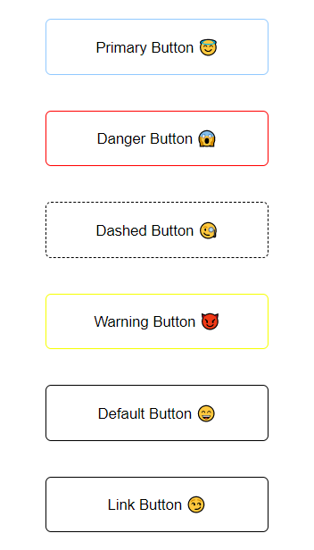

# hanifbtnui

> Simple button designs for your projects. Selectable types: primary,danger, default, dashed, warning and link.


[](https://www.npmjs.com/package/hanifbtnui) [](https://standardjs.com)

## Install

```bash
npm install --save hanifbtnui
```

## Usage

```jsx
import React, { Component } from 'react'

import MyComponent from 'hanifbtnui'
import 'hanifbtnui/dist/index.css'

class Example extends Component {
  render() {
    return <MyComponent />
  }
}
```

## License

MIT © [HanifeMehan](https://github.com/HanifeMehan)
